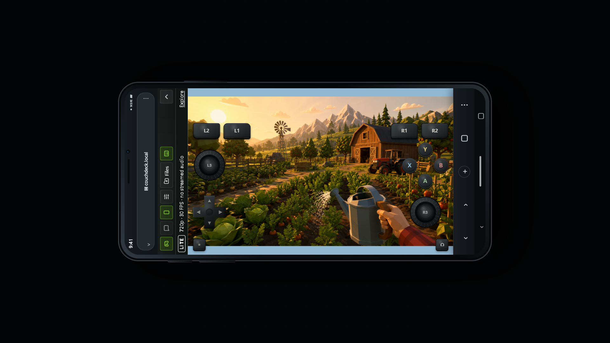
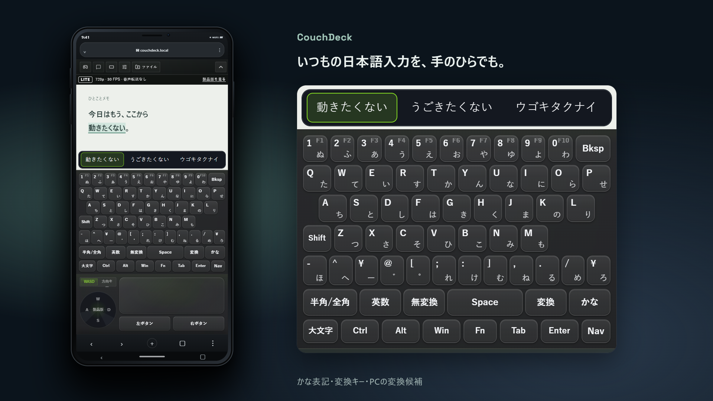
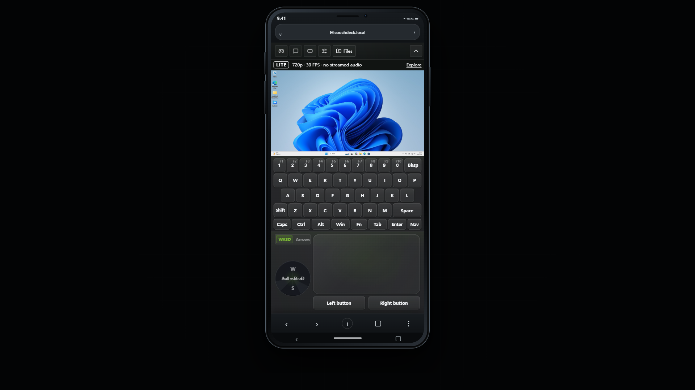

# CouchDeck

[English](README.md) · [简体中文](README.zh-CN.md) · **日本語** · [Español](README.es.md)

**スマホのブラウザーを、Windows PC のゲームパッド、キーボード、タッチパッドに。**

PC にインストールし、スマホで QR コードを読み取るだけ。ブラウザーを開けば、PC の画面を見ながらデュアルスティックでゲームを遊んだり、キーボードとタッチパッドに切り替えてデスクトップを操作したりできます。スマホに専用アプリを入れる必要はなく、アカウント登録も不要です。

ゲームパッドの L3/R3、日本語キーボードの「変換」、ドイツ語キーボードの AltGr、PC の IME の変換候補。こうした細かい機能も、スマホで使えます。

Windows x64 · Android / iPhone のブラウザー

## ダウンロード

[Windows x64 用インストーラーをダウンロード](https://github.com/CouchDeckApp/CouchDeck/releases/download/v1.1.0/CouchDeck-1.1.0-Lite.zip)。ZIP を展開し、操作する PC で中にある 1 つの Windows 用インストーラー（`.exe`）を実行してください。

GitHub が自動生成する `Source code (zip)` / `Source code (tar.gz)` は、このリポジトリのドキュメントのスナップショットです。インストーラーではなく、CouchDeck 独自のソースコードも含まれていません。

## キーボードには、12 種類の配列を用意しました

メニューの翻訳だけでは、使い慣れたキーボードにはなりません。見慣れた文字の位置、地域ごとによく使う記号、IME 専用のキーまで、スマホのキーボードに取り入れています。

| 配列 | 見落としがちな細部にも対応 |
| --- | --- |
| 米国（US）、英国（UK） | `£`、`@`、引用符、`#` の位置をそれぞれの配列に合わせて配置 |
| 日本語 JIS 106/109 | かな刻印、`¥` / `ろ` の専用キー、「半角/全角」「変換」「無変換」「英数」「かな」 |
| 韓国語 2ボル式 | 子音・母音、Shift で入力する濃音のレイヤー、`한/영` と `한자` キー |
| 標準注音、倉頡 / 速成の字根 | 注音符号、声調、倉頡の字根をキー上に表示 |
| ドイツ語 QWERTZ、フランス語 AZERTY | それぞれの文字配列、アクセント付き文字、AltGr の記号レイヤー |
| ロシア語 ЙЦУКЕН | キリル文字、`Ё`、ロシア語配列の記号、Shift / Caps Lock に対応するキー表示 |
| ブラジルポルトガル語 ABNT2 | `Ç`、アクセントキー、追加の物理キーに対応するキー配置 |
| スペイン語（スペイン）、スペイン語（中南米） | 2 種類の配列に個別対応し、それぞれの句読点とアクセントの位置を再現 |

Shift、Caps Lock、AltGr を押すと、キー上の表示も対応する文字に変わります。配列と表示言語は別々に選べるので、メニューを中国語にして日本語キーボードを使うこともできます。

スマホの配列は、Windows で現在使っている配列に合わせてください。文字の組み立てや変換は、PC にある IME が処理します。

## PC の変換候補を、スマホから選ぶ

「PC の変換候補をスマホに表示」を有効にすると、PC の IME が表示する候補をスマホのキーボードのそばに表示し、タップして選べます。

たとえば Microsoft Pinyin で漢字を選んだり、Microsoft 日本語 IME で変換結果を選んだりできます。縮小されたデスクトップを見ながら、マウスを少しずつ候補欄に合わせる必要はありません。候補がないときは候補バーが隠れるので、文字キーのスペースを圧迫しません。この機能には PC の IME 側の対応が必要です。

## デュアルスティックは、押し込みにも対応

Windows 側に仮想 Xbox 360 コントローラーを用意し、この形式のコントローラー入力に対応する PC ゲームで使えます。デュアルスティック、ABXY、方向パッド、ショルダーボタン、トリガー、Back、Start をスマホから操作できます。

**L3/R3 も押せます。** 対応するスティックを素早く 2 回タップし、2 回目は指を離さずにそのままスティックを動かすと、押し込みと方向入力を同時に送れます。ゲーム内でダッシュ操作を押したまま移動する、といった使い方ができます。

スティックは単なる 4 方向のボタンではなく、連続的な方向入力に対応しています。両方のスティックと複数のボタンを同時に操作でき、横画面と縦画面それぞれにレイアウトがあります。キーボードに切り替えて用事を済ませてから戻っても、ページの切り替えによってゲームパッドが切断・再接続されることはありません。

## 横持ちには、横持ち用のキーボード

縦画面ではキーボードの下にタッチパッドを配置。横画面では PC の画面を挟んでキーボードが左右に分かれ、両方の親指でそれぞれの側を操作できます。

- **キーボードとタッチパッドの高さは個別に調整可能**。画面の広さや指の使い方に合わせてスペースを配分でき、設定は使用中のブラウザーに保存されます。
- **Ctrl、Alt、Win は 1 回タップすると押した状態を維持**。続けて文字キーをタップすれば `Ctrl+C`、`Ctrl+V` などを入力でき、修飾キーを指で押さえ続ける必要はありません。
- **Shift は 1 文字だけ大文字にする操作に対応**し、入力後は自動で解除されます。大文字を続けて入力するときは Caps Lock を使います。
- **Esc、Tab、方向キー、Home/End、Page Up/Down、Insert/Delete** など、PC で使うキーにもアクセスできます。
- **Fn で数字行を F1–F10 に切り替え可能**。PC のキーボードを探す必要はありません。

## 使い慣れたタッチパッドのジェスチャーも

タップ、ダブルクリック、右クリック、ドラッグをスマホのタッチパッドで操作できます。2 回タップして 2 回目は指を離さずに滑らせると、ウィンドウやファイルをドラッグできます。2 本指では上下だけでなく、左右にもスクロールできます。

画面の文字が小さければ、2 本指で拡大し、表示位置をずらして確認できます。表示された PC の画面に直接タッチして操作することもできます。ポインターの移動感度を調整できるほか、操作中は PC のポインターの大きさや、対応するディスプレイの拡大率も変更でき、小さな画面でも操作対象を見やすくできます。

## 日常で使う、ほかの機能

- **10 種類の表示言語**：简体中文、繁體中文、English、日本語、한국어、Русский、Español、Deutsch、Français、Português。
- **LAN 内で使え、アカウント登録やオンライン認証は不要**。PC は有線 LAN、スマホは Wi-Fi でも接続できます。接続を記憶すれば、毎回 QR コードを読み取る必要はありません。
- **PC のメインウィンドウを非表示にしても、バックグラウンドで操作を受け付けます**。使用中は Windows にスリープしないよう要求します。
- **診断、コンポーネント修復、トラブル調査レポートの出力を内蔵**。問題が起きたら、各所のログを探し回る前にソフト内で確認できます。

スマホの画面には、2048 も隠れています。見つけたら 1 ゲームどうぞ。

## クイックスタート

1. PC に CouchDeck をインストールして起動し、案内に沿って初期設定を済ませます。コンポーネントのインストール時に、Windows の管理者権限の確認が必要になる場合があります。
2. スマホと PC を同じ LAN に接続します。PC は有線 LAN、スマホは同じルーターの Wi-Fi でも構いません。
3. PC の画面にある QR コードをスマホで読み取り、ブラウザーで開いて接続ボタンをタップします。

接続後は、スマホの画面でゲームパッド、キーボード、タッチパッドを切り替えられます。PC の画面もスマホに表示されます。

## 動作環境

- **PC**：Windows 10 バージョン 1809 以降、Windows 11、x64 アーキテクチャ。システムに適用可能な累積更新プログラムをインストールしてください。
- **スマホ**：Android または iPhone と、比較的新しいブラウザー。まずは Chrome または Safari をお試しください。QR コード読み取りアプリの内蔵ブラウザーによっては、接続や画面の再生に支障が出る場合があります。
- **ネットワーク**：スマホから PC のある LAN にアクセスできること。ゲスト Wi-Fi やルーターの端末間通信を遮断する設定が、接続を妨げる場合があります。

ストリーミングの品質は、PC のエンコード性能、スマホのブラウザー、LAN の品質によって変わります。

## ネットワークと通知

CouchDeck は新バージョンの通知や開発者からのお知らせを取得します。新しいバージョンを自動でダウンロード・インストールすることはありません。インターネットに接続していなくても、LAN 内での操作は利用できます。

## 問題が起きたら

不具合を報告する際は、PC 側の「診断」から「トラブル調査レポートを出力」をクリックし、生成された **ZIP ファイルを添付**して [CouchDeck.HelloDev@outlook.com](mailto:CouchDeck.HelloDev@outlook.com) に送信してください。症状、発生時刻、再現手順を添えてください。スマホが関係する場合は、機種名とブラウザーも記載してください。補足としてスクリーンショットも添付できます。

レポートには PC 名、ファイルパス、ネットワーク情報が含まれる場合があるため、公開 Issue への投稿は推奨しません。機能の提案、表示言語の追加、特定の用途に合わせたキーボードレイアウトの追加要望は、Issues で受け付けています。

## このリポジトリとライセンスについて

このリポジトリは、インストーラーの配布、ドキュメントの管理、フィードバックの収集に使用しています。CouchDeck 独自のコードはクローズドソースで、このリポジトリでは提供していません。

完全な状態で改変されていない公式インストーラーは、無償で共有できます。詳しくは [CouchDeck Lite の再配布許諾](LITE-REDISTRIBUTION-PERMISSION.md) を参照してください。ソフトウェアの利用条件は、インストーラー内の `licenses/PROPRIETARY-NOTICE.md` に記載されています。サードパーティー製コンポーネントには、それぞれのライセンスが適用されます。関連する通知、ライセンス文書、対象となるコンポーネントの対応ソースコードは、インストーラーに同梱されています。

---

[CouchDeck 公式サイト](https://couchdeck.pages.dev/)
