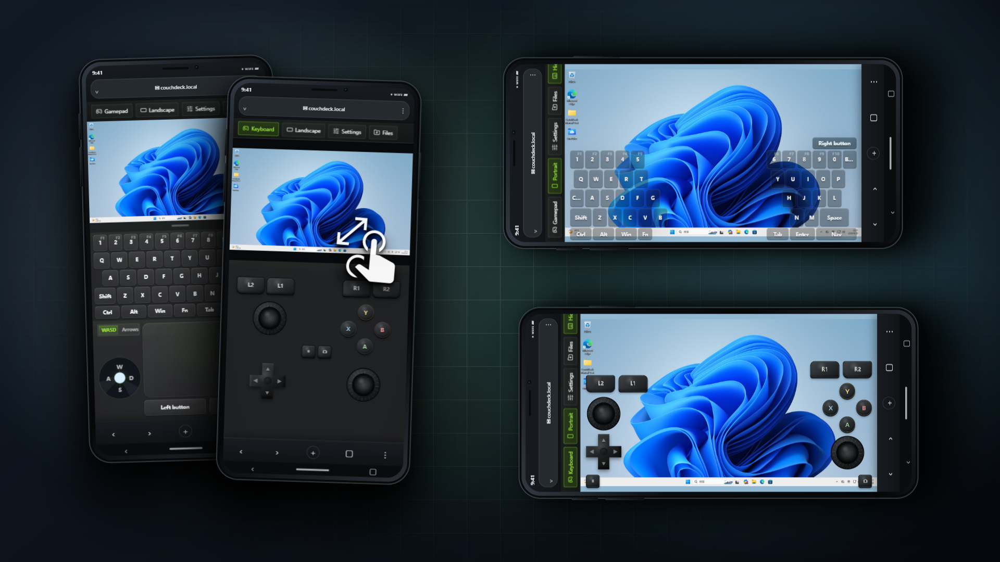
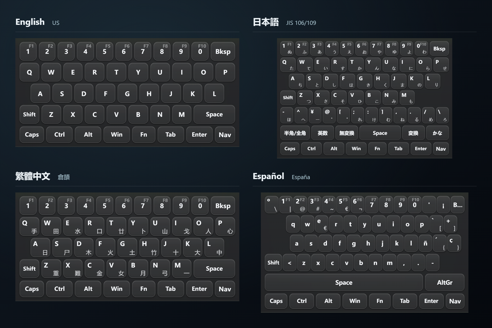
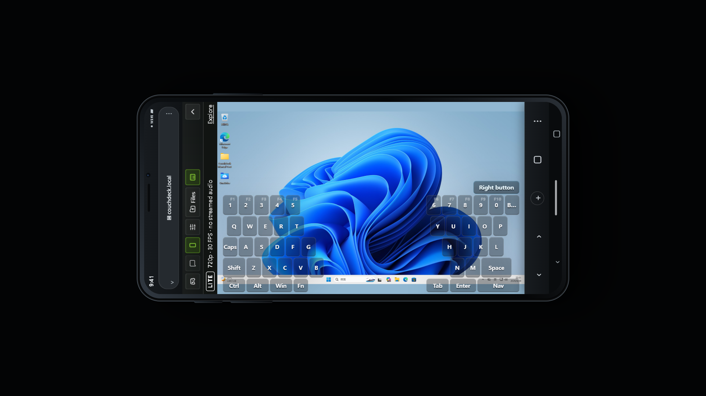
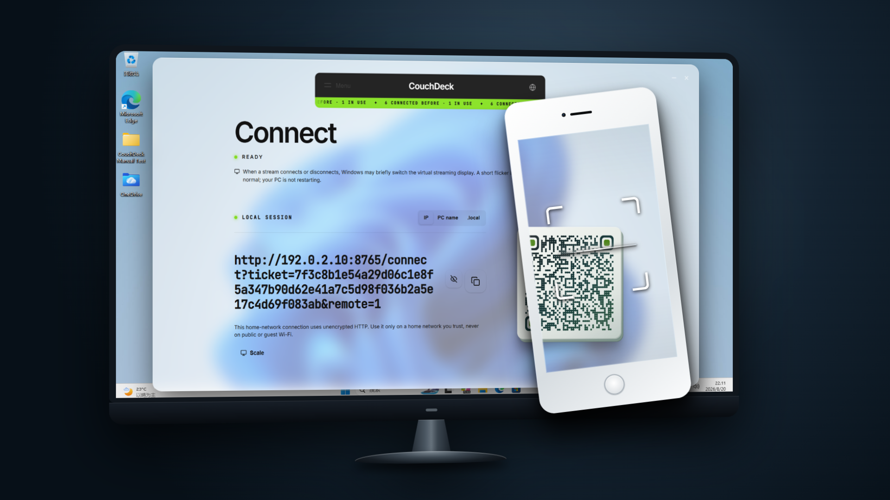

# CouchDeck — Phone Gamepad, Keyboard & Remote Control for Windows

**English** · [简体中文](README.zh-CN.md) · [日本語](README.ja.md) · [Español](README.es.md)

**Turn your phone's browser into a gamepad, keyboard, and trackpad for your Windows PC.**

Install on your PC, scan with your phone. Open the browser to see your desktop and play with dual analog sticks, or switch to the keyboard and trackpad to use your PC. No dedicated phone app. No account required.

L3/R3 stick clicks, the Japanese keyboard's 「変換」 key, AltGr on a German keyboard, your PC's input-method candidates—all those little things come along, too.

Windows x64 · Android / iPhone browsers



## Download

[Download for Windows x64](https://github.com/CouchDeckApp/CouchDeck-Phone-Gamepad-Keyboard-Remote-Control-for-Windows/releases/download/v1.1.0/CouchDeck-1.1.0-Lite.zip). Extract the ZIP, then run the single Windows installer (`.exe`) inside it on the PC you want to control.

Download URL (copy if the link above is unavailable):

```text
https://github.com/CouchDeckApp/CouchDeck-Phone-Gamepad-Keyboard-Remote-Control-for-Windows/releases/download/v1.1.0/CouchDeck-1.1.0-Lite.zip
```

GitHub's automatically generated `Source code (zip)` / `Source code (tar.gz)` downloads are snapshots of this repository's documents—not installers, and not CouchDeck's proprietary source code.

## A small keyboard, twelve layouts

More than translated menus. Familiar letter positions, regional symbols, and input-method keys deserve their own place on your phone.



| Layouts | A few details that are easy to overlook |
| --- | --- |
| US and UK English | Separate positions for `£`, `@`, quotation marks, and `#` |
| Japanese JIS 106/109 | Kana legends, dedicated `¥` / `ろ` keys, and 「半角/全角」「変換」「無変換」「英数」「かな」 |
| Korean two-set | Consonants, vowels, Shift-layer doubled consonants, plus `한/영` and `한자` keys |
| Standard Zhuyin and Cangjie / Quick radicals | Zhuyin symbols, tone marks, and Cangjie radicals right on the keycaps |
| German QWERTZ and French AZERTY | Their own letter arrangements, accented characters, and AltGr symbol layers |
| Russian ЙЦУКЕН | Cyrillic legends, `Ё`, regional punctuation, and Shift / Caps Lock keycaps |
| Brazilian Portuguese ABNT2 | `Ç`, accent keys, and extra physical key positions |
| Spanish (Spain) and Spanish (Latin America) | Separate layouts with their own punctuation and accent positions |

Keycaps change to show the corresponding characters when you use Shift, Caps Lock, or AltGr. The keyboard layout and interface language are independent: you can use Chinese menus with a Japanese keyboard.

Match the phone's layout to the one currently selected in Windows. Text composition and conversion are handled by the input method already on your PC.

## Your PC's candidate list, at your fingertips

Enable the option to show PC input-method candidates on your phone, and candidates can appear beside the phone keyboard for direct selection.

For example, select Chinese characters with Microsoft Pinyin or conversion results with Microsoft Japanese IME—without squinting at a shrunken desktop and steering the pointer into the candidate window. When there are no candidates, the strip gets out of the way without crowding the letter keys. This feature requires a supported PC input method.


## Dual sticks—with stick clicks, too


CouchDeck provides a virtual Xbox 360 controller on Windows for PC games that support that type of controller. Dual analog sticks, ABXY, the D-pad, shoulder buttons, triggers, Back, and Start are all on your phone.

**L3/R3 work, too.** Double-tap a stick, hold the second touch, and keep moving it to send both a stick click and directional input—for example, to hold sprint while moving in a game.

The sticks provide continuous directional input, not just four direction buttons. Both sticks and multiple buttons can be used together, with layouts for portrait and landscape. Switch to the keyboard to take care of something, then come back: changing views does not repeatedly disconnect and reconnect the controller.

## Turn the phone sideways. The keyboard follows suit.

Portrait puts the trackpad below the keyboard. Landscape splits the keyboard around the PC view, with each thumb taking a side.



- **Adjust keyboard and trackpad heights separately** to suit your screen and fingers. Preferences are saved in the current browser.
- **Tap Ctrl, Alt, or Win to hold it**, then tap a letter for shortcuts such as `Ctrl+C` and `Ctrl+V`. No need to keep a finger on the modifier key.
- **Shift works for a single keystroke**, then releases automatically. Use Caps Lock for continuous capitals.
- **Esc, Tab, arrow keys, Home/End, Page Up/Down, and Insert/Delete** have their own places, too.
- **Fn turns the number row into F1–F10**, so you do not have to reach for the PC keyboard.

## Familiar trackpad gestures, included


Tap, double-click, right-click, and drag from the phone's trackpad. Double-tap and slide without lifting on the second touch to drag a window or file. Two-finger scrolling works both vertically and horizontally.

Text in the PC view too small? Pinch to zoom and pan around, or interact directly with the desktop through touch. Pointer movement sensitivity is adjustable. During the control session, you can also adjust the PC's pointer size and supported display scaling to make targets easier to see on a small screen.

## A few more everyday details

- **10 interface languages**: 简体中文, 繁體中文, English, 日本語, 한국어, Русский, Español, Deutsch, Français, and Português.
- **Local-network use, without account registration or online activation.** Your PC can use Ethernet while your phone uses Wi-Fi. Once the connection is remembered, you do not have to start with a QR scan every time.
- **Hide the main PC window and keep controlling in the background.** During use, CouchDeck requests that Windows stay awake.
- **Built-in diagnostics, component repair, and diagnostic-report export**, so you have a place to start instead of hunting down logs.

There is also a little 2048 game hidden in the phone interface. If you find it, have a round.

## Quick start



On a new PC, Windows may show **Unknown publisher**. If SmartScreen blocks the installer, confirm that it came from this repository's Releases, then select **More info → Run anyway**. Do not disable Windows security protection.

1. Install and open CouchDeck on your PC, then follow the first-run setup. Component installation may ask for Windows administrator approval.
2. Connect your phone and PC to the same local network. Your PC can use Ethernet while your phone connects to the same router over Wi-Fi.
3. Scan the QR code shown on the PC with your phone, open it in the browser, and connect.

Once connected, switch between the gamepad, keyboard, and trackpad on your phone. The PC view appears on the phone as well.

## Requirements

- **PC**: Windows 10 1809 or later, or Windows 11, on x64. Install the cumulative updates available for your system.
- **Phone**: Android or iPhone with a recent browser. Chrome or Safari are good starting points; embedded browsers in some QR-scanning apps may affect connectivity or video playback.
- **Network**: The phone must be able to reach the PC on the local network. Guest Wi-Fi or router device isolation can prevent connections.

Streaming performance depends on the PC's encoding capabilities, the phone browser, and local-network quality.

## Network and notifications

CouchDeck fetches version notifications and developer news. It does not automatically download or install new versions. Local-network control works without an internet connection.

## Reporting problems

For a bug report, export a diagnostic report from **Diagnostics** on the PC and email the exported **report file (`.txt`) as an attachment** to [CouchDeck.HelloDev@outlook.com](mailto:CouchDeck.HelloDev@outlook.com). Include the symptoms, when the problem occurred, and steps to reproduce it. For phone-related issues, include the model and browser; screenshots can supplement the report.

Reports may contain computer names, file paths, and network information, so posting them in public Issues is not recommended. Feature suggestions, requests for additional interface languages, or new keyboard layouts for specific uses can be submitted in Issues.

## About this repository and licensing

This repository distributes installers, maintains documentation, and collects feedback. CouchDeck's own code is closed source and is not provided here.

You are welcome to share complete, unmodified official installers free of charge; see the [CouchDeck Lite sharing permission](LITE-REDISTRIBUTION-PERMISSION.md). Software terms are included in `licenses/PROPRIETARY-NOTICE.md` in the installation package. Third-party components remain under their own licenses; the package includes their notices, license texts, and corresponding source code where applicable.

---

[CouchDeck website](https://couchdeck.pages.dev/)
